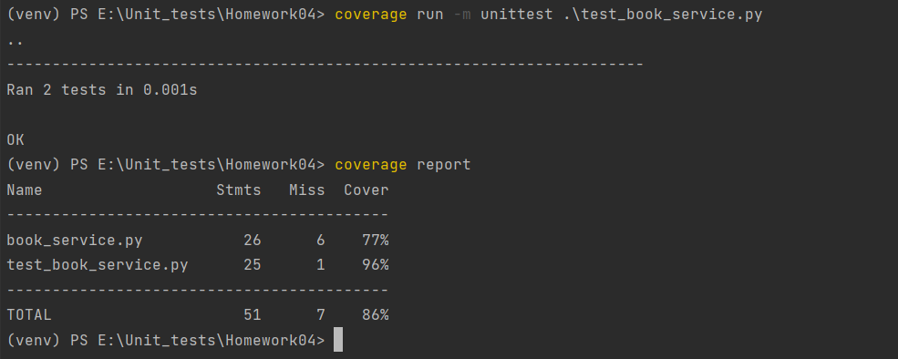

Задание 1. Ответьте письменно на вопросы:

1)  Почему использование тестовых заглушек может быть полезным при написании модульных тестов?

Тестовые заглушки позволяют изолировать тестируемый модуль от других зависимостей, что упрощает обнаружение и устранение ошибок.
Заглушки могут заменить сложные или медленные части кода, что ускоряет выполнение тестов и позволяет быстрее получать результаты.
Заглушками можно заменить код, который сложно или невозможно протестировать напрямую, что позволяет улучшить покрытие тестами и выявить больше потенциальных ошибок.

2) Какой тип тестовой заглушки следует использовать, если вам нужно проверить, что метод был вызван с определенными аргументами?

Mock-объект -Тестовая заглушкa, которая сохраняет информацию о переданных аргументах. Например, поддерживает метод проверки того, были ли заданы определенные аргументы при вызове метода.

3) Какой тип тестовой заглушки следует использовать, если вам просто нужно вернуть определенное значение или исключение в ответ на вызов метода?

Stab — объекты, также называемые заглушками, которые возвращают заранее определенные значения на определенные входные данные.

4) Какой тип тестовой заглушки вы бы использовали для имитации взаимодействия с внешним API или базой данных? 

Fake небольшие фрагменты кода, контролируемые тестами, которые имитируют поведение фактических частей, которые они заменяют.

Задание 2.

У вас есть класс BookService, который использует интерфейс BookRepository для получения информации о книгах из базы данных. Ваша задача написать unit-тесты для BookService, используя Mockito для создания мок-объекта BookRepository.

